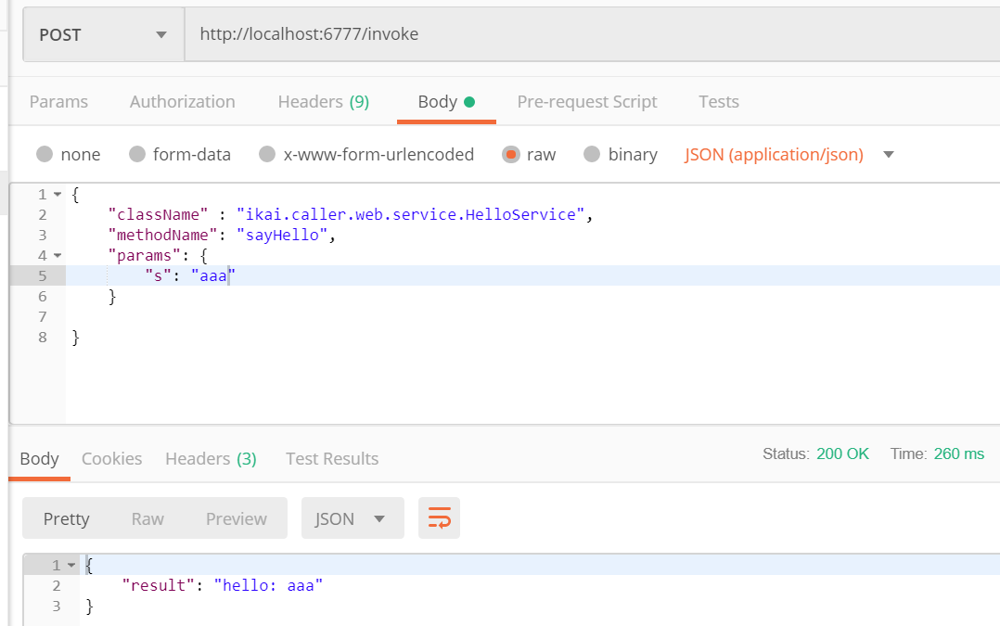

# spring-bean-caller
Dynamic call spring bean's method through http api.

## What is spring-bean-caller
Spring-bean-caller is a helpful tool that debugging your spring application. It allows you calling your method through http api.

## Requirements
Jdk.version >= 1.8

## How to use it
* Add dependency to you project
```xml
<dependency>
  <groupId>cc.ikai.tool</groupId>
  <artifactId>spring-bean-caller</artifactId>
  <version>0.1.0</version>
</dependency>
```

* Add parameters info when compiling. 
```xml 
<plugin>
    <groupId>org.apache.maven.plugins</groupId>
    <artifactId>maven-compiler-plugin</artifactId>
    <version>3.7.0</version>
    <configuration>
        <source>8</source>
        <target>8</target>
        <encoding>UTF-8</encoding>
        <compilerArgs>
            <arg>-parameters</arg>
        </compilerArgs>
    </configuration>
</plugin>
```

* Add package scan configuration. 
    - If you use spring boot, you can do like below. 
    ```java 
    @Import(CallerPackageScanConfig.class)
    ```
    - And if you use xml file, add `cc.ikai.caller` to your base scan package. 

* Write your controller.
```java
@RestController
public class HelpController {
    @Autowired
    private Caller caller;
    @RequestMapping("invoke")
    public Map<String, Object> invoke(@RequestBody Map<String, Object> requestMap) {
        Map<String, Object> resultMap = new HashMap<>();
        resultMap.put("result", caller.doCall(requestMap));
        return resultMap;
    }
}
```

* Call the method. 
    - Suppose you have a service like below:
    ```java 
    package ikai.caller.web.service;
    @Service
    public class HelloService { 
        public String sayHello(String s) {
            return "hello:" + s;
        }
    }
    ```
    - And you can call this method using the following json parameter through `invoke` api.
    ```json
    {
    	"className" : "ikai.caller.web.service.HelloService",
    	"methodName": "sayHello",
    	"params": {
    		"s": "aaa" 
    	}
    }    
    ```
    - The result like below.
    

## Input json property description
* className - The full bean class name.
* methodName - The calling method name.
* params - The calling method parameters.
* directSetFiledForObjectParam - If this set true, the object parameter will set filed directly instead of using the setter method. If your parameters have builder pattern object, you should set this true. Default is false.

## More examples
You can see more examples in [spring-bean-caller-test](https://github.com/zhangjikai/spring-bean-caller-test)
